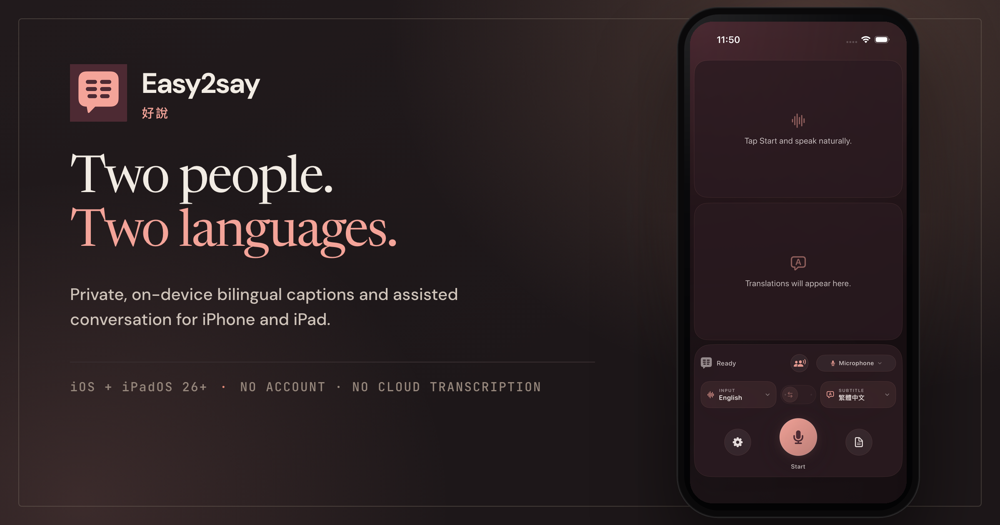

<p align="center">
  
</p>

<h1 align="center">Easy2say</h1>

<p align="center">
  <strong>Two languages. One shared moment.</strong><br>
  Private, on-device bilingual captions for iPhone and iPad.
</p>

<p align="center">
  English · <a href="README.zh-Hant.md">繁體中文</a> · <a href="README.zh-CN.md">简体中文</a>
</p>

<p align="center">
  <a href="https://github.com/audreyt/easy2say/releases/latest/download/Easy2say-universal.pkg"><strong>Download macOS</strong></a><br>
  <sub>macOS 26 or later · Apple silicon and Intel</sub>
</p>

<p align="center">
  <a href="https://easy2say.ai/">
    
  </a>
</p>

> [!IMPORTANT]
> **This is the iOS-first fork of [`franklioxygen/v2s`](https://github.com/franklioxygen/v2s).** It begins with [upstream pull request #20](https://github.com/franklioxygen/v2s/pull/20), preserves the expanded runtime language catalog contributed there by [@oToToT](https://github.com/oToToT), and publishes a Universal 2 package of the macOS target alongside the iPhone and iPad work.

## The conversation, not the chrome

Easy2say listens through the device microphone, transcribes with Apple Speech, translates with Apple Translation, and gives the original speech and its translation equal space.

- **One screen, two languages.** The source and translation each receive half the display.
- **Made for either orientation.** Portrait stacks both halves; landscape places them side by side.
- **Made to share.** Flip the other person’s half 180° to read naturally across a table.
- **Fullscreen and audience display.** Fullscreen captions fill the iPhone or iPad screen. On Mac, open an audience view on any display or projector.
- **Two-way by design.** Two people can speak their own languages into one microphone and read each utterance in the language they understand.
- **Private by construction.** No account, network client, cloud transcription, analytics, or telemetry.
- **Scroll back without stopping.** Use the overlay scrollbar on Mac or the transcript sheet on iPhone and iPad while captions continue.

### How two-way conversation works

Apple does not expose a spoken-language identification API. Conversation mode therefore runs one `SpeechTranscriber` per language over the same microphone capture and selects the lane with the stronger transcription confidence. If a noisy room fools that comparison, tapping either half claims the floor explicitly.

## Caption modes

| | Caption mode | Two-way conversation |
| --- | --- | --- |
| **Input** | One selected language | Two selected languages sharing one microphone |
| **Display** | Original and translation together | Each speaker’s words translated for the other person |
| **Portrait** | Two stacked halves | Two stacked halves; either side can be flipped |
| **Landscape** | Two side-by-side halves | Two side-by-side halves |
| **Taigi** | Supported as assistive captions | Not available in automatic two-way mode |

## Local Taigi captions

The iOS and macOS targets can use the bundled 4-bit Breeze-ASR-26 model for on-device Taigi captions. The picker deliberately labels this **`台語（華文轉寫）`**: the model maps Taigi speech to Mandarin Chinese characters, not native Taibun orthography.

Treat the output as assistive transcription, not an authoritative record. The model’s published 30-clip government-PSA benchmark averages **30.13% character error rate**, with individual clips ranging from **14.49% to 52.78%**. The first load may take several minutes while Core ML specializes roughly 890 MB of weights; later runs use Apple’s cache.

The release bundle contains the complete model and tokenizer. WhisperKit’s network downloader is disabled.

## Privacy, literally

- No accounts or network client.
- No cloud transcription, analytics, or telemetry.
- No updater in the iOS target.
- Microphone audio and captions are never sent to an Easy2say server; there is no Easy2say server.
- Apple may initially download language assets required by Speech and Translation. Processing then uses those assets on device.
- Voice activity detection runs the [Silero VAD](THIRD_PARTY_NOTICES.md) model through Apple’s system Core ML framework.
- The app bundles no ONNX Runtime, and the [Silero conversion is reproducible](scripts/convert_silero_vad_coreml.py).
- Taigi recognition uses [WhisperKit and a pinned Breeze-ASR-26 Core ML conversion](THIRD_PARTY_NOTICES.md).

## iOS and macOS at a glance

| Capability | Easy2say on iPhone/iPad | Easy2say on macOS |
| --- | --- | --- |
| Live microphone captions | Yes | Yes |
| On-device speech recognition and translation | Yes | Yes |
| Caption presentation | Equal source and translation halves | Translucent vertical or side-by-side overlay; either direction |
| Fullscreen presentation | Full-screen captions; tap to show controls | Audience Display on any selected screen |
| Capture another app’s audio | No; iOS is microphone-only | Yes |
| Float captions over other apps | No; captions stay inside Easy2say | Yes |

## Requirements

- iPhone or iPad running iOS or iPadOS 26.0 or later
- Mac running macOS 26.0 or later for the Universal 2 package
- Xcode 26 or later
- Microphone and Speech Recognition permissions
- A local Apple development team when installing on a physical device

### Universal macOS package

The downloadable `.pkg` contains native `arm64` and `x86_64` app slices. It bundles Breeze-ASR-26 and Silero VAD, but not TranslateGemma, private Monlam Whisper, or Melong model weights. Starting with 0.3.39, the app and installer are signed with Developer ID, notarized by Apple, and stapled. Gatekeeper accepts the download without a manual override.

Version 0.3.38 is the first macOS build under the Easy2say name and update feed. Existing `v2s` users must install this package once manually because older builds still follow the upstream feed and signing key. The installer removes `/Applications/v2s.app` only when its bundle identifier matches this app, installs `/Applications/Easy2say.app`, and preserves the existing settings and model cache paths.

To build a local package:

```bash
DEVELOPER_DIR=/Applications/Xcode.app/Contents/Developer \
  ./scripts/build_universal_pkg.sh
```

## Build and run

Install the project tools, fetch the pinned Taigi model, generate the iOS project, and open it from the repository root:

```bash
git clone https://github.com/audreyt/easy2say.git
cd easy2say
brew install xcodegen huggingface-cli
./scripts/fetch_breeze_asr_26.sh
(cd ios && xcodegen generate)
open ios/v2s-ios.xcodeproj
```

Choose the **`v2s-ios`** scheme and an iPhone, iPad, or simulator, then run from Xcode. For a physical device, select your own team under **Signing & Capabilities**; the repository intentionally commits no `DEVELOPMENT_TEAM` value.

### Command-line simulator build

```bash
cd ios
xcodegen generate
xcodebuild \
  -project v2s-ios.xcodeproj \
  -scheme v2s-ios \
  -configuration Release \
  -destination "generic/platform=iOS Simulator" \
  -derivedDataPath .build/sim \
  CODE_SIGNING_ALLOWED=NO \
  build
```

## Development gates

Run the shared engine tests from the repository root:

```bash
swift test
```

Build the original macOS target as regression coverage:

```bash
xcodebuild \
  -project v2s.xcodeproj \
  -scheme v2s \
  -configuration Release \
  -derivedDataPath .build/release \
  CODE_SIGNING_ALLOWED=NO \
  CODE_SIGN_IDENTITY=- \
  build
```

Generate and build the iOS target for the simulator:

```bash
cd ios
xcodegen generate
xcodebuild \
  -project v2s-ios.xcodeproj \
  -scheme v2s-ios \
  -configuration Release \
  -destination "generic/platform=iOS Simulator" \
  -derivedDataPath .build/sim \
  CODE_SIGNING_ALLOWED=NO \
  build
```

## Lineage and attribution

This fork keeps upstream attribution in [`NOTICE`](NOTICE) and third-party terms in [`THIRD_PARTY_NOTICES.md`](THIRD_PARTY_NOTICES.md). The upstream README declares the project MIT-licensed, but the upstream repository currently contains no `LICENSE` file. Consult upstream before publicly redistributing this fork or its binaries.
