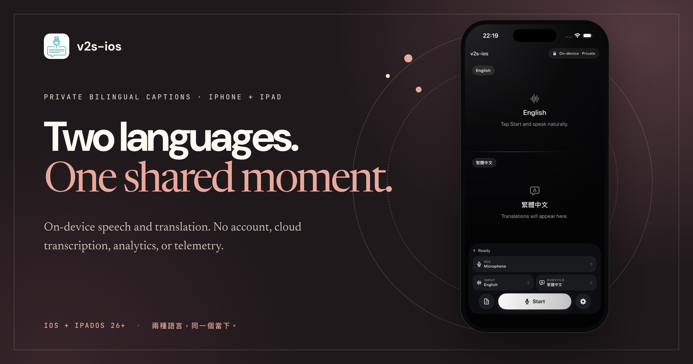

<p align="center">
  
</p>

<h1 align="center">v2s-ios</h1>

<p align="center">
  <strong>Two languages. One shared moment.</strong><br>
  Private, on-device bilingual captions for iPhone and iPad.
</p>

<p align="center">
  English · <a href="README.zh-Hant.md">繁體中文</a> · <a href="README.zh-CN.md">简体中文</a>
</p>

<p align="center">
  <a href="https://audreyt.github.io/v2s/">
    
  </a>
</p>

> [!IMPORTANT]
> **This is the iOS-first fork of [`franklioxygen/v2s`](https://github.com/franklioxygen/v2s), not a replacement for its macOS app.** It begins with [upstream pull request #20](https://github.com/franklioxygen/v2s/pull/20), preserves the expanded runtime language catalog contributed there by [@oToToT](https://github.com/oToToT), and keeps the original macOS target buildable for shared-engine development and regression coverage.

## The conversation, not the chrome

`v2s-ios` listens through the device microphone, transcribes with Apple Speech, translates with Apple Translation, and gives the original speech and its translation equal space.

- **One screen, two languages.** The source and translation each receive half the display.
- **Made for either orientation.** Portrait stacks both halves; landscape places them side by side.
- **Made to share.** Flip the other person’s half 180° to read naturally across a table.
- **Two-way by design.** Two people can speak their own languages into one microphone and read each utterance in the language they understand.
- **Private by construction.** No account, network client, cloud transcription, analytics, or telemetry.
- **A transcript when you need it.** Review the session and adjust settings without leaving the app.

### How two-way conversation works

Apple does not expose a spoken-language identification API. Conversation mode therefore runs one `SpeechTranscriber` per language over the same microphone capture and selects the lane with the stronger transcription confidence. If a noisy room fools that comparison, tapping either half claims the floor explicitly.

## Caption modes

| | Caption mode | Two-way conversation |
| --- | --- | --- |
| **Input** | One selected language | Two selected languages sharing one microphone |
| **Display** | Original and translation together | Each speaker’s words translated for the other person |
| **Portrait** | Two stacked halves | Two stacked halves; either side can be flipped |
| **Landscape** | Two side-by-side halves | Two side-by-side halves |
| **Taigi** | Supported as assistive captions | Not available in automatic two-way mode |

## Local Taigi captions

The iOS and macOS targets can use the bundled 4-bit Breeze-ASR-26 model for on-device Taigi captions. The picker deliberately labels this **`台語（華文轉寫）`**: the model maps Taigi speech to Mandarin Chinese characters, not native Taibun orthography.

Treat the output as assistive transcription, not an authoritative record. The model’s published 30-clip government-PSA benchmark averages **30.13% character error rate**, with individual clips ranging from **14.49% to 52.78%**. The first load may take several minutes while Core ML specializes roughly 890 MB of weights; later runs use Apple’s cache.

The release bundle contains the complete model and tokenizer. WhisperKit’s network downloader is disabled.

## Privacy, literally

- No accounts or network client.
- No cloud transcription, analytics, or telemetry.
- No updater in the iOS target.
- Microphone audio and captions are never sent to a v2s server; there is no v2s server.
- Apple may initially download language assets required by Speech and Translation. Processing then uses those assets on device.
- Voice activity detection runs the [Silero VAD](THIRD_PARTY_NOTICES.md) model through Apple’s system Core ML framework.
- The app bundles no ONNX Runtime, and the [Silero conversion is reproducible](scripts/convert_silero_vad_coreml.py).
- Taigi recognition uses [WhisperKit and a pinned Breeze-ASR-26 Core ML conversion](THIRD_PARTY_NOTICES.md).

## iOS and upstream macOS at a glance

| Capability | `v2s-ios` on iPhone/iPad | Upstream `v2s` on macOS |
| --- | --- | --- |
| Live microphone captions | Yes | Yes |
| On-device speech recognition and translation | Yes | Yes |
| Caption presentation | Equal source and translation halves | Floating two-line subtitle bar |
| Capture another app’s audio | No; iOS is microphone-only | Yes |
| Float captions over other apps | No; captions stay inside `v2s-ios` | Yes |

The iOS app cannot capture another app’s audio and does not provide a cross-app floating overlay. For the macOS product, releases, and documentation, use the [upstream project](https://github.com/franklioxygen/v2s).

## Requirements

- iPhone or iPad running iOS or iPadOS 26.0 or later
- Xcode 26 or later
- Microphone and Speech Recognition permissions
- A local Apple development team when installing on a physical device

## Build and run

Install the project tools, fetch the pinned Taigi model, generate the iOS project, and open it from the repository root:

```bash
git clone https://github.com/audreyt/v2s.git
cd v2s
brew install xcodegen huggingface-cli
./scripts/fetch_breeze_asr_26.sh
(cd ios && xcodegen generate)
open ios/v2s-ios.xcodeproj
```

Choose the **`v2s-ios`** scheme and an iPhone, iPad, or simulator, then run from Xcode. For a physical device, select your own team under **Signing & Capabilities**; the repository intentionally commits no `DEVELOPMENT_TEAM` value.

### Command-line simulator build

```bash
cd ios
xcodegen generate
xcodebuild \
  -project v2s-ios.xcodeproj \
  -scheme v2s-ios \
  -configuration Release \
  -destination "generic/platform=iOS Simulator" \
  -derivedDataPath .build/sim \
  CODE_SIGNING_ALLOWED=NO \
  build
```

## Development gates

Run the shared engine tests from the repository root:

```bash
swift test
```

Build the original macOS target as regression coverage:

```bash
xcodebuild \
  -project v2s.xcodeproj \
  -scheme v2s \
  -configuration Release \
  -derivedDataPath .build/release \
  CODE_SIGNING_ALLOWED=NO \
  CODE_SIGN_IDENTITY=- \
  build
```

Generate and build the iOS target for the simulator:

```bash
cd ios
xcodegen generate
xcodebuild \
  -project v2s-ios.xcodeproj \
  -scheme v2s-ios \
  -configuration Release \
  -destination "generic/platform=iOS Simulator" \
  -derivedDataPath .build/sim \
  CODE_SIGNING_ALLOWED=NO \
  build
```

## Lineage and attribution

This fork keeps upstream attribution in [`NOTICE`](NOTICE) and third-party terms in [`THIRD_PARTY_NOTICES.md`](THIRD_PARTY_NOTICES.md). The upstream README declares the project MIT-licensed, but the upstream repository currently contains no `LICENSE` file. Consult upstream before publicly redistributing this fork or its binaries.
