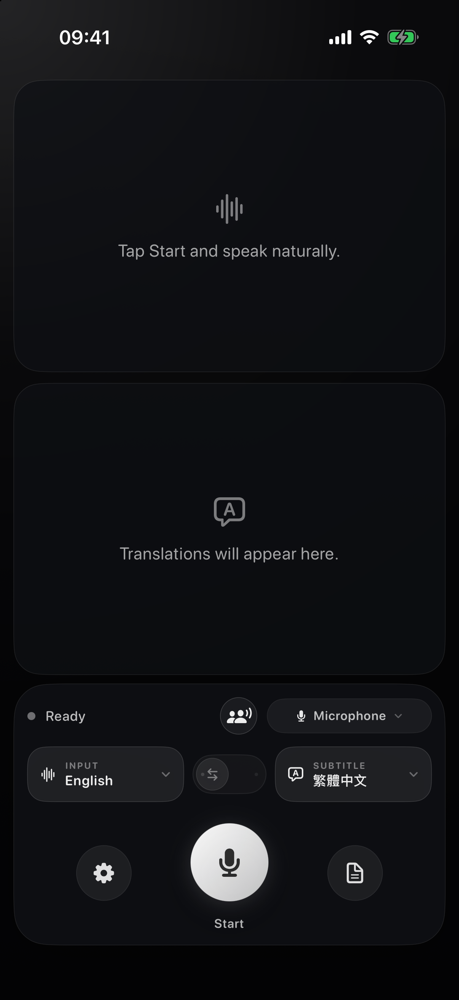

# v2s-ios

[English](README.md) · [繁體中文](README.zh-Hant.md) · 简体中文

**适用于 iPhone 和 iPad 的私密、端侧双语字幕。**

`v2s-ios` 是 [franklioxygen/v2s](https://github.com/franklioxygen/v2s) 的一个以 iOS 为首要平台的分支。它使用设备麦克风、Apple Speech 和 Apple Translation，同时显示源语言语音和翻译结果。此分支基于 [上游拉取请求 #20](https://github.com/franklioxygen/v2s/pull/20)，并保留由 [@oToToT](https://github.com/oToToT) 贡献的扩展运行时语言目录。

<p align="center">
  
</p>

## 功能

- 在设备端转写麦克风音频并翻译字幕。
- 源语言字幕和目标语言译文各占屏幕一半。
- 竖屏时上下排列，横屏时并排显示。
- 仅使用 iPhone 或 iPad 麦克风。
- 默认字幕输出为繁体中文（`zh-Hant`），同时保留繁体中文（`zh-Hant`）和简体中文（`zh-Hans`）选项。
- 提供应用程序内的转写记录和设置界面。
- 提供双向对话模式：两人各说自己的语言、共用一支麦克风，每段话都会以说话者的语言转写，并以听者的语言显示译文；对方那一半屏幕可上下翻转，方便隔桌阅读。Apple 并未提供口语语言识别 API，因此该模式会为两种语言各运行一个 `SpeechTranscriber`，共用同一份录音，再选择转写置信度较高的那一路；环境嘈杂到判断失准时，轻触任一半屏幕即可指定发言方。
- iOS 与 macOS 版可使用内置的 4 位 Breeze-ASR-26 模型，在设备端生成台语字幕。语言菜单明确标注为「`台語（華文轉寫）`」，因为该模型会将台语语音映射为华文汉字，而不是台语正字。模型公布的 30 段政府宣导音频基准平均字符错误率为 30.13%（单段 14.49%–52.78%），应视为辅助转写，不宜当作权威记录。Core ML 首次特化约 890 MB 权重时可能需要数分钟，之后会使用 Apple 的缓存。台语目前支持字幕模式，不支持自动双向对话模式。

## iOS 与 macOS 功能对比

| 功能 | iPhone/iPad 上的 `v2s-ios` | macOS 上的上游 `v2s` |
| --- | --- | --- |
| 实时麦克风字幕 | 是 | 是 |
| 设备端语音识别和翻译 | 是 | 是 |
| 字幕呈现方式 | 源语言字幕和译文各占一半；竖屏时上下排列，横屏时并排显示 | 悬浮式双行字幕条 |
| 采集其他应用程序的音频 | 否。iOS 应用程序仅使用麦克风。 | 是 |
| 在其他应用程序上方悬浮显示字幕 | 否。字幕始终显示在 `v2s-ios` 内。 | 是 |

iOS 应用程序无法采集其他应用程序的音频，也不提供跨应用程序的悬浮层。

## 隐私

- 无账号，也没有网络客户端。
- 不使用云端转写、分析或遥测。
- iOS 目标中不包含更新程序。
- `v2s-ios` 不会将麦克风音频或字幕发送到服务器。
- Apple 可能会先下载其 Speech 和 Translation 框架所需的语言资源。随后，应用程序使用这些资源在设备端进行处理。
- 语音活动检测通过 Apple 系统内建的 Core ML 框架运行 [Silero VAD](THIRD_PARTY_NOTICES.md) 模型；`v2s-ios` 不打包 ONNX Runtime，且[转换过程可复现](scripts/convert_silero_vad_coreml.py)。
- 台语识别使用 [WhisperKit 与固定版本的 Breeze-ASR-26 Core ML 转换模型](THIRD_PARTY_NOTICES.md)。发行版本内含完整模型和 tokenizer，并停用 WhisperKit 的网络下载功能。

## 环境要求

- 运行 iOS 或 iPadOS 26.0 或更高版本的 iPhone 或 iPad
- Xcode 26 或更高版本
- 麦克风和语音识别权限

## 构建与运行

安装 XcodeGen，在仓库根目录中生成 iOS 项目并将其打开：

```bash
brew install xcodegen huggingface-cli
./scripts/fetch_breeze_asr_26.sh
cd ios
xcodegen generate
open v2s-ios.xcodeproj
```

在 Xcode 中选择 `v2s-ios` scheme 和 iPhone 或 iPad 模拟器，然后运行应用程序。

通过命令行针对 iOS 模拟器构建：

```bash
cd ios
xcodegen generate
xcodebuild \
  -project v2s-ios.xcodeproj \
  -scheme v2s-ios \
  -configuration Debug \
  -destination "generic/platform=iOS Simulator" \
  -derivedDataPath .build/sim \
  CODE_SIGNING_ALLOWED=NO \
  build
```

对于实体设备，请在本机 Xcode 的 Signing & Capabilities 中选择你的开发团队。仓库中未提交 `DEVELOPMENT_TEAM` 值。

## 开发检查

在仓库根目录运行共享引擎测试：

```bash
swift test
```

构建原始 macOS 目标，作为回归验证：

```bash
xcodebuild \
  -project v2s.xcodeproj \
  -scheme v2s \
  -configuration Release \
  -derivedDataPath .build/release \
  CODE_SIGNING_ALLOWED=NO \
  CODE_SIGN_IDENTITY=- \
  build
```

生成 iOS 目标并针对模拟器构建：

```bash
cd ios
xcodegen generate
xcodebuild \
  -project v2s-ios.xcodeproj \
  -scheme v2s-ios \
  -configuration Release \
  -destination "generic/platform=iOS Simulator" \
  -derivedDataPath .build/sim \
  CODE_SIGNING_ALLOWED=NO \
  build
```

## 上游与 macOS

此分支保留原始 macOS 目标的可构建状态，用于共享引擎开发和回归验证。macOS 产品、发行版和文档请使用 [franklioxygen/v2s](https://github.com/franklioxygen/v2s)。
## 许可证

[上游 README](https://github.com/franklioxygen/v2s#license) 声明使用 MIT 许可证，但上游仓库目前没有 `LICENSE` 文件。此分支在 [NOTICE](NOTICE) 中保留上游署名信息。公开重新分发此分支或其二进制文件前，请咨询上游。
