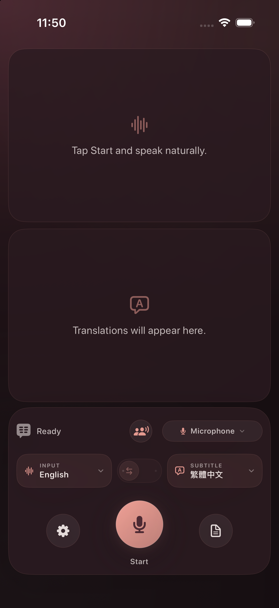

# Easy2say

[English](README.md) · 繁體中文 · [简体中文](README.zh-CN.md)

**iPhone 與 iPad 上私密、於裝置端處理的雙語字幕。**

`Easy2say` 是以 iOS 為優先、源自 [franklioxygen/v2s](https://github.com/franklioxygen/v2s) 的分支。它透過裝置麥克風、Apple Speech 與 Apple Translation，同時顯示語音辨識原文與翻譯。此分支以[上游 pull request #20](https://github.com/franklioxygen/v2s/pull/20) 為起點，並保留該 PR 中由 [@oToToT](https://github.com/oToToT) 貢獻、擴充後的執行階段語言目錄。

<p align="center">
  
</p>

## 功能

- 在裝置端轉寫麥克風音訊並翻譯字幕。
- 讓原文與目標語言譯文各佔一半畫面。
- 直向時上下排列兩個區塊，橫向時左右並排。
- 只使用 iPhone 或 iPad 的麥克風。
- 字幕輸出預設為繁體中文（`zh-Hant`），並可選擇繁體中文（`zh-Hant`）或簡體中文（`zh-Hans`）。
- 字幕進行時也可回看：Mac 使用浮層捲軸，iPhone 與 iPad 使用字幕記錄表單，不必停止聽打。
- 全螢幕與觀眾畫面。iPhone、iPad 可讓字幕填滿畫面；Mac 可在指定螢幕或投影機顯示觀眾畫面。
- 提供雙向對話模式：兩人各說自己的語言、共用一支麥克風，每段話都會以說話者的語言轉寫，並以聽者的語言顯示譯文；對方那一半畫面可上下翻轉，方便隔桌閱讀。Apple 並未提供口語語言辨識 API，因此本模式會為兩種語言各執行一個 `SpeechTranscriber`，共用同一份錄音，再挑選轉寫信賴度較高的那一路；環境吵雜到判斷失準時，輕觸任一半畫面即可指定發言方。
- iOS 與 macOS 版可使用內建的 4 位元 Breeze-ASR-26 模型，在裝置端產生台語字幕。語言選單明確標示為「`台語（華文轉寫）`」，因為這個模型會將台語語音對應為華文漢字，而非台語正字。模型公布的 30 段政府宣導音檔基準平均字元錯誤率為 30.13%（單段 14.49%–52.78%），應視為輔助轉寫，不宜當成權威紀錄。Core ML 首次特化約 890 MB 權重時可能需要數分鐘，之後會使用 Apple 的快取。台語目前支援字幕模式，不支援自動雙向對話模式。

## iOS 與 macOS 功能比較

| 功能 | iPhone/iPad 上的 Easy2say | macOS 上的 Easy2say |
| --- | --- | --- |
| 即時麥克風字幕 | 是 | 是 |
| 裝置端語音辨識與翻譯 | 是 | 是 |
| 字幕呈現方式 | 原文與翻譯各佔一半；直向時上下排列，橫向時左右並排 | 半透明浮動字幕面板，可上下或左右分欄，並可反轉順序 |
| 全螢幕呈現 | 全螢幕字幕；輕觸顯示控制項 | 可在任一指定螢幕顯示觀眾畫面 |
| 擷取其他應用程式的音訊 | 否。iOS 應用程式僅使用麥克風。 | 是 |
| 將字幕浮動顯示於其他應用程式上方 | 否。字幕只顯示在 Easy2say 內。 | 是 |

iOS 應用程式無法擷取其他應用程式的音訊，也不提供跨應用程式的浮動覆蓋層。

## 隱私

- 不設帳號，也沒有網路用戶端。
- 不使用雲端轉寫，也沒有分析或遙測功能。
- iOS 目標不含更新程式。
- Easy2say 不會將麥克風音訊或字幕傳送至伺服器。
- Apple 可能會先下載其 Speech 與 Translation 框架所需的語言資源。之後，應用程式會使用這些資源在裝置端處理。
- 語音活動偵測透過 Apple 系統內建的 Core ML 框架執行 [Silero VAD](THIRD_PARTY_NOTICES.md) 模型；Easy2say 不打包 ONNX Runtime，且[轉換過程可重現](scripts/convert_silero_vad_coreml.py)。
- 台語辨識使用 [WhisperKit 與固定版本的 Breeze-ASR-26 Core ML 轉換模型](THIRD_PARTY_NOTICES.md)。發行版本內含完整模型與 tokenizer，並停用 WhisperKit 的網路下載功能。

## 系統需求

- 執行 iOS 或 iPadOS 26.0 以上版本的 iPhone 或 iPad
- Xcode 26 或以上版本
- 麥克風與語音辨識權限

## 建置與執行

請安裝 XcodeGen、產生 iOS 專案，並從儲存庫根目錄開啟專案：

```bash
brew install xcodegen huggingface-cli
./scripts/fetch_breeze_asr_26.sh
cd ios
xcodegen generate
open v2s-ios.xcodeproj
```

在 Xcode 中選擇 `v2s-ios` scheme 與 iPhone 或 iPad 模擬器，然後執行應用程式。

從命令列建置 iOS 模擬器版本：

```bash
cd ios
xcodegen generate
xcodebuild \
  -project v2s-ios.xcodeproj \
  -scheme v2s-ios \
  -configuration Debug \
  -destination "generic/platform=iOS Simulator" \
  -derivedDataPath .build/sim \
  CODE_SIGNING_ALLOWED=NO \
  build
```

若要在實體裝置上執行，請在本機 Xcode 的 Signing & Capabilities 中選取你的開發團隊。儲存庫未提交任何 `DEVELOPMENT_TEAM` 值。

## 開發驗證

從儲存庫根目錄執行共用引擎測試：

```bash
swift test
```

建置原始 macOS 目標，作為迴歸驗證：

```bash
xcodebuild \
  -project v2s.xcodeproj \
  -scheme v2s \
  -configuration Release \
  -derivedDataPath .build/release \
  CODE_SIGNING_ALLOWED=NO \
  CODE_SIGN_IDENTITY=- \
  build
```

產生 iOS 目標，並為模擬器建置：

```bash
cd ios
xcodegen generate
xcodebuild \
  -project v2s-ios.xcodeproj \
  -scheme v2s-ios \
  -configuration Release \
  -destination "generic/platform=iOS Simulator" \
  -derivedDataPath .build/sim \
  CODE_SIGNING_ALLOWED=NO \
  build
```

## macOS 與上游

此分支會發佈 Easy2say 的 Universal 2 macOS 安裝套件；請從[本分支最新版本](https://github.com/audreyt/easy2say/releases/latest/download/Easy2say-universal.pkg)下載。內建 Breeze-ASR-26 與 Silero VAD，不含 TranslateGemma、私有 Monlam Whisper 或 Melong 權重。自 0.3.39 版起，應用程式與安裝套件皆以 Developer ID 簽署，並已通過 Apple 公證、附加公證票證。Gatekeeper 可直接開啟下載檔案，無需手動略過安全設定。

0.3.38 是首次改用 Easy2say 名稱與更新來源的 macOS 版本；既有 `v2s` 使用者需手動安裝一次，安裝程式會移除同一 bundle ID 的 `/Applications/v2s.app`，並保留原有設定與模型快取。原始 macOS 專案與血緣資訊仍見 [franklioxygen/v2s](https://github.com/franklioxygen/v2s)。

## 授權

[上游 README](https://github.com/franklioxygen/v2s#license) 宣告採用 MIT 授權，但上游儲存庫目前沒有 `LICENSE` 檔案。此分支在 [NOTICE](NOTICE) 中保留上游歸屬資訊。公開重新散佈此分支或其二進位檔之前，請先洽詢上游專案。
